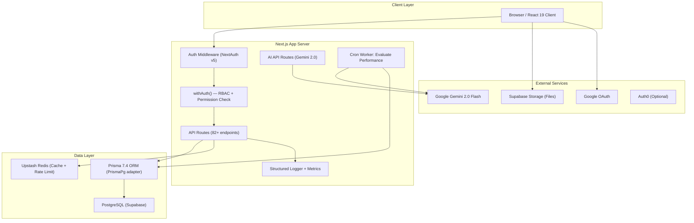

# System Architecture — EMS Pro

## Overview

EMS Pro is a multi-tenant Employee Management System built on Next.js 16 (App Router) with React 19, Prisma 7.4 ORM, and a hybrid AI layer powered by Google Gemini 2.0. It features a comprehensive RBAC system with 5 roles, 18 modules, and 55 database models.

---

## Architecture Diagram



---

## Component Breakdown

### 1. Frontend (Next.js 16 App Router, React 19)

- **24 pages**: Role-gated via `canAccessModule()` — sidebar dynamically shows modules per role
- **41 components**: Custom UI design system (Card, Badge, Button, Dialog, Input, Select, Textarea, Avatar, StatCard, PageHeader, Tabs, DataTable, Spinner, EmptyState, Skeleton)
- **4 dashboards**: AdminDashboard (CEO/HR), PayrollDashboard, TeamLeadDashboard, EmployeeDashboard
- **State**: React `useState/useCallback/useMemo`, `react-hook-form` + Zod for all forms
- **Auth Context**: `useAuth()` hook provides `user.role`, `user.name`, `user.organizationId`
- **Theming**: TailwindCSS 3.4 with custom design tokens (`text`, `text-2`, `text-3`, `bg`, `surface`, `border`, `accent`, etc.)
- **Toasts**: Sonner (migrated from react-hot-toast)

### 2. API Layer (82+ Route Handlers)

All routes use:

- **`withAuth({ module, action })`** — RBAC permission check via `lib/permissions.ts`
- **Zod schema validation** on all POST/PUT bodies (`lib/schemas/*.ts`, 30+ schemas)
- **`apiSuccess()`/`apiError()`** normalized response envelope
- **`orgFilter(ctx)`** for multi-tenant query scoping
- **Structured logging** — `lib/logger.ts` with `logContext` (AsyncLocalStorage for requestId/orgId/userId)
- **Metrics collection** — `lib/metrics.ts` with auto-alerting on latency thresholds

Key route groups:

| Prefix | Count | Description |
| --- | --- | --- |
| `/api/employees` | 6 | Employee CRUD, credentials, profile, documents |
| `/api/attendance` | 9 | Attendance, holidays, policy, shifts, regularization |
| `/api/time-tracker` | 7 | Check-in/out, heartbeat, break, status, history |
| `/api/payroll` | 6 | Payroll CRUD, run, config, import, payslip |
| `/api/performance` | 1 | Performance reviews (Daily/Monthly forms) |
| `/api/teams` | 4+ | Team CRUD, members |
| `/api/admin/*` | 7 | Analytics, sessions, metrics, performance |
| `/api/cron/*` | 4 | AI agents, workers |
| Other | 30+ | Leaves, training, tickets, docs, assets, etc. |

### 3. RBAC System (`lib/permissions.ts`)

```
Roles: CEO, HR, PAYROLL, TEAM_LEAD, EMPLOYEE
Modules: 18 (EMPLOYEES, PAYROLL, TEAMS, PERFORMANCE, FEEDBACK, DASHBOARD, REPORTS,
          ATTENDANCE, LEAVES, TRAINING, ANNOUNCEMENTS, ASSETS, DOCUMENTS, TICKETS,
          RECRUITMENT, RESIGNATION, ORGANIZATION, SETTINGS, WORKFLOWS)
Actions: VIEW, CREATE, UPDATE, DELETE, REVIEW, ASSIGN, EXPORT, IMPORT
```

Key helpers:

- `hasPermission(role, module, action)` — Check specific permission
- `canAccessModule(role, module)` — Check if role has any access
- `getModulesForRole(role)` — Get accessible modules (drives sidebar)
- `scopeEmployeeQuery(ctx, module)` — Prisma `where` clause for data isolation
- `scopeEntityQuery(ctx, module)` — Prisma `where` for entity-level scoping

### 4. Database (PostgreSQL via Prisma 7.4)

**55 models, 38 enums** in `prisma/schema.prisma` (1300+ lines)

Core: `Organization`, `User`, `Employee` (+Profile/Address/Banking), `Department`, `Education`
Features: `Attendance`, `TimeSession`, `BreakEntry`, `Leave`, `Payroll`, `ProvidentFund`, `PerformanceReview`, `Training`, `Asset`, `Document`, `Ticket`, `Announcement`, `Candidate`, `Resignation`, `CalendarEvent`, `Kudos`
Teams: `Team`, `TeamMember`, `Shift`, `ShiftAssignment`, `AttendancePolicy`, `Holiday`
Compliance: `PayrollComplianceConfig`, `TaxSlab`, `PayrollAudit`
AI: `PerformanceMetrics`, `WeeklyScores`, `AgentExecutionLogs`, `Notifications`, `AdminAlerts`
Workflow: `WorkflowTemplate`, `WorkflowStep`, `WorkflowInstance`, `WorkflowAction`
Enterprise: `UserSession`, `Webhook`, `WebhookDelivery`, `SavedReport`, `ReportSchedule`, `InAppNotification`

Key constraints:

- `Department` — `@@unique([name, organizationId])` (multi-tenant scoped)
- `Employee` — `@@unique([employeeCode])`, `@@unique([email])`
- All queries scoped by `organizationId` via `orgFilter()`

### 5. Autonomous AI Agent

See [PERFORMANCE_AGENT_ARCHITECTURE.md](./PERFORMANCE_AGENT_ARCHITECTURE.md)

### 6. Caching Strategy

| Cache Key | TTL | Purpose |
| --- | --- | --- |
| `admin:dashboard:metrics` | 5 min | Dashboard stats |
| `ratelimit:{ip}:{window}` | 70s | Rate limiting |
| Redis FIFO queue | — | Background job queue |

---

## Security Model

- **Auth**: JWT-based sessions via NextAuth v5 (Credentials + Google OAuth + Auth0)
- **RBAC**: 5 roles × 18 modules × 8 actions permission matrix enforced at middleware and route level
- **Session Management**: `UserSession` model with `isRevoked` flag, session listing/revocation for admins
- **Cron Security**: Bearer token (`CRON_SECRET`) required
- **Input Validation**: 30+ Zod schemas on all mutation endpoints
- **Rate Limiting**: 60 requests/minute per IP (Redis-backed, in-memory fallback)
- **Data Isolation**: Multi-tenant `organizationId` scoping on all queries
- **PII Protection**: Safe `select` on sensitive routes (no salary/bank data leaks across roles)
- **Structured Logging**: JSON logging with request IDs, org context, latency metrics
- **Security Headers**: X-Frame-Options, X-Content-Type-Options, Referrer-Policy in middleware

---

## Key Library Files

| File | Key Exports |
| --- | --- |
| `lib/auth.ts` | `auth`, `signIn`, `signOut` — NextAuth config |
| `lib/security.ts` | `withAuth()`, `orgFilter()` — RBAC middleware |
| `lib/permissions.ts` | `hasPermission()`, `canAccessModule()`, `PERMISSIONS` matrix |
| `lib/prisma.ts` | `prisma` — Singleton with PrismaPg adapter |
| `lib/api-response.ts` | `apiSuccess()`, `apiError()`, `ApiErrorCode` |
| `lib/logger.ts` | `logger`, `logContext` — Structured JSON logging |
| `lib/metrics.ts` | `MetricsCollector` — API metrics + auto-alerting |
| `lib/redis.ts` | `redis` — Upstash + in-memory fallback |
| `lib/payroll-engine.ts` | `calculateNetSalary()`, `calculatePFContributions()` |
| `lib/attendance-engine.ts` | `evaluateAttendance()`, `isWorkingDay()` |
| `lib/workflow-engine.ts` | `WorkflowEngine.initiateWorkflow()`, `.processAction()` |
| `lib/schemas/*.ts` | 30+ Zod schemas for validation |
