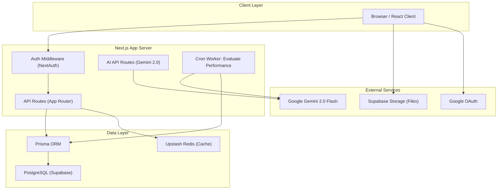

# System Architecture — EMS Pro

## Overview
EMS Pro is a multi-tenant-ready Employee Management System built on Next.js 16 with a hybrid AI layer powered by Google Gemini 2.0.

---

## Architecture Diagram

---

## Component Breakdown

### 1. Frontend (Next.js 16 App Router)
- **Pages**: Role-gated pages (admin sees `/employees`, `/admin/*`; employee sees `/performance`, `/leave`, etc.)
- **Components**: `EmployeeList`, `EmployeeFormModal`, `TimeTracker`, modal system
- **State**: React `useState/useCallback`, `react-hook-form` + Zod for all form validation
- **Auth Context**: `useAuth()` hook provides session-aware role checks

### 2. API Layer (Next.js Route Handlers)
All routes use:
- **NextAuth session validation** (`auth()`)
- **Zod schema validation** on all POST/PUT bodies
- **Prisma transactions** for multi-table writes
- **Redis caching** on dashboard metrics (TTL: 5 minutes)
- **Proper HTTP status codes** and detailed error formats

Key route groups:
| Prefix | Description |
|---|---|
| `/api/employees` | Employee CRUD |
| `/api/departments` | Department CRUD + DELETE |
| `/api/admin/*` | Admin-only analytics |
| `/api/cron/*` | Cron/agent endpoints (Bearer auth) |
| `/api/time-tracker/*` | Time tracking session management |
| `/api/chat` | AI chatbot relay |

### 3. Database (PostgreSQL via Prisma)

Core models: `User`, `Employee`, `Department`, `Organization`

Phase 6 models: `PerformanceMetrics`, `WeeklyScores`, `AgentExecutionLogs`, `Notifications`, `AdminAlerts`

**Key constraints:**
- `Department` — `@@unique([name, organizationId])` (multi-tenant scoped)
- `Employee` — `@@unique([employeeCode])`, `@@unique([email])`

### 4. Autonomous AI Agent
See [PERFORMANCE_AGENT_ARCHITECTURE.md](./PERFORMANCE_AGENT_ARCHITECTURE.md)

### 5. Caching Strategy
| Cache Key | TTL | Purpose |
|---|---|---|
| `admin:dashboard:metrics` | 5 min | Dashboard stats |
| `ratelimit:{ip}:{window}` | 70s | Rate limiting |

---

## Security Model
- **Auth**: JWT-based sessions via NextAuth
- **RBAC**: `ADMIN` and `EMPLOYEE` roles enforced at both middleware and route level
- **Cron Security**: Bearer token (`CRON_SECRET`) required for agent trigger
- **Input Validation**: Zod schemas on all mutation endpoints
- **Rate Limiting**: 60 requests/minute per IP (Redis-backed, in-memory fallback)
